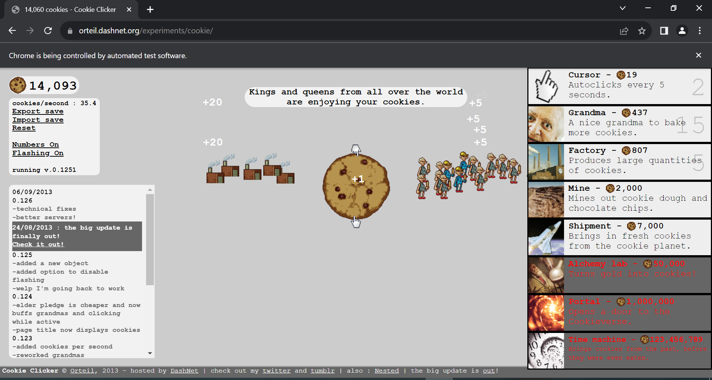

##Cookie Clicker Automation

Description: This Python script automates playing the "Cookie Clicker" game by utilizing Selenium WebDriver. Selenium is used to simulate user actions such as clicking on elements and purchasing items from the in-game store. The script continuously clicks the cookie on the game webpage and calculates the cookies per second (CPS) achieved. By leveraging Selenium, users can automate gameplay actions, making it easier to progress in the game without manual input.

